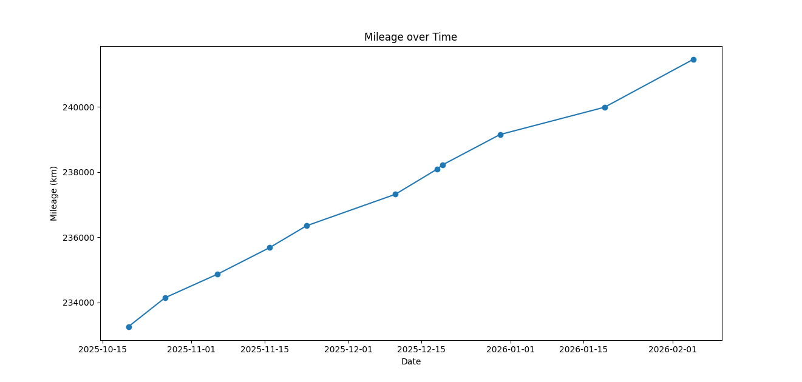

# Volkswagen Passat B6, 2010, 10LK601

## Details
- Engine: Highline Bluemotion 1.6 TDI 105BHP
- Gear box: 5 speed manual
- Doors: 4 + boot
- Cream leather interior

## Modifications
- Tinted rear windows and rear windshield
- B7 steering wheel [?]
- Passat CC alloys
- Roof racks
- Android touch screen radio unit with AA and CarPlay
- LED rear license plate lights and new rear license plate frame installed 22/11/2025

## Replacements/Repairs
### 18/12/2025
- 238,094km
- Changed battery for a new start-stop one from Halfords (four years' warranty)
- Stop-Start now works, which is kind of good but also bad. 
- The battery cost EUR199 in Halfords and I was going to install it myself but I wasn't sure if I had to do something with a battery management computer to prevent over charging so I went to O'Connell Batteries, Unit J3, Marina Commercial Park, Cork to ask if it's necessary, and maybe get it fitted, and it wasn't necessary and I got it fitted but they charged me EUR50. 

### 19/12/2025
- 238,221km
- From left low-beam bulb replaced
- Bought in Motorway Auto Parts & Accessories for EUR7.50, 19/12/2025 10:53

## Services
### 16/11/2025
- 235,684km
- Oil filter and oil changed (4.3L oil)
- Air filter checked but alright
- Next service due at 250,000km (15,000km interval)

## Fuel
- 25/1/2026, 16:24: 40.98L @ 170.8c/L -> EUR69.99
- Missed one here
- 2/2/2026, 20:47: 58.76L @ 172.9c/L -> EUR101.60

## Mileage
- 20/10/2025, 18:58: 233,256km
- 27/10/2025, 14:27: 234,144km
- 6/11/2025, 00:03: 234,866km
- 16/11/2025, 17:02: 235,684km
- 23/11/2025, 17:14: 236,351km
- 10/12/2025, 20:02: 237,319km
- 18/12/2025, 17:21: 238,094km
- 19/12/2025, 10:58: 238,221km
- 30/12/2025, 15:07: 239,154km
- 19/1/2026, 14:59: 239,994km
- 5/2/2026, 20:34: 241,468km

## Images

